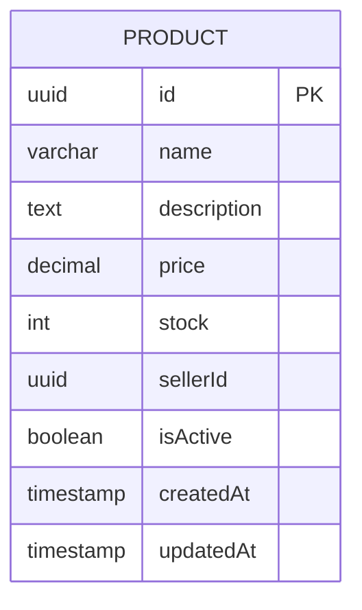

<div align="center">

# 📦 Products Service

_A NestJS product catalog and catalog management service for the marketplace, backed by PostgreSQL and TypeORM._

---

📃 [About](#-about)&nbsp;&nbsp;•&nbsp;&nbsp;
🏗️ [Role in the Architecture](#️-role-in-the-architecture)&nbsp;&nbsp;•&nbsp;&nbsp;
🧠 [Architecture Concepts](#-architecture-concepts)&nbsp;&nbsp;•&nbsp;&nbsp;
🛠️ [Technologies](#️-technologies)&nbsp;&nbsp;•&nbsp;&nbsp;
💾 [Database Diagram](#-database-diagram)&nbsp;&nbsp;•&nbsp;&nbsp;
🚀 [Getting Started](#-getting-started)&nbsp;&nbsp;•&nbsp;&nbsp;
📖 [API Documentation](#-api-documentation)&nbsp;&nbsp;•&nbsp;&nbsp;
🧪 [Testing](#-testing)

</div>

---

## 📃 About

The products service is the marketplace catalog service. It owns the product entity, seller-bound product creation rules, product listings, seller product queries, and product detail retrieval for the catalog domain.

Products are persisted independently from the users and checkout services, which makes the service the authoritative source for item metadata such as name, description, price, stock, seller ownership, activity state, and audit timestamps.

## 🏗️ Role in the Architecture

The products service is reached by the API Gateway through the gateway’s product proxy controller. The gateway forwards catalog requests to this service, while the service itself validates the request user context and only allows product creation when the caller role is `seller`.

The product endpoints exposed by this service are:

- `POST /products` for seller product creation.
- `GET /products` for catalog listing.
- `GET /products/seller/:sellerId` for seller-scoped product search.
- `GET /products/:id` for single-product retrieval.

The listing and detail endpoints are marked public, while the creation endpoint is protected by the shared JWT authentication guard and requires the authenticated identity to be a seller.

## 🧠 Architecture Concepts

The code confirms the following service-level architecture patterns:

- **Database per Service** — the products service configures an isolated PostgreSQL connection and owns the `Product` entity mapping in TypeORM.
- **API Gateway Pattern** — the API Gateway is the inbound facade for all HTTP business requests, while the products service is reached behind that routing layer.
- **JWT Authentication** — the service authenticates incoming requests with `JwtStrategy`, `JwtAuthGuard`, and a global `APP_GUARD` registration.
- **Role-Based Authorization** — product creation checks the request user role and rejects any caller whose role is not `seller`.
- **Health Checks** — the service’s `HealthController` uses `TypeOrmHealthIndicator` to verify that the database is reachable.
- **Observability Middleware** — `MetricsService` uses `prom-client` to expose counters and histograms for request volume and duration.

## 🛠️ Technologies

- ⚙️ **[NestJS](https://nestjs.com/)** — backend framework for controllers, services, modules, and auth strategy wiring.
- 🟦 **[TypeScript](https://www.typescriptlang.org/)** — primary language used across the service.
- 🌐 **[Express](https://expressjs.com/)** — HTTP platform used by the NestJS runtime.
- 🔐 **[@nestjs/jwt](https://github.com/nestjs/jwt)** — JWT signing and token verification support.
- 🛡️ **[@nestjs/passport](https://github.com/nestjs/passport)** — Passport integration and JWT strategy support.
- 📘 **[@nestjs/swagger](https://docs.nestjs.com/openapi/introduction)** — Swagger/OpenAPI setup for the service.
- 🩺 **[@nestjs/terminus](https://docs.nestjs.com/recipes/terminus)** — health checks for the products service.
- 🗄️ **[@nestjs/typeorm](https://docs.nestjs.com/techniques/database)** — TypeORM integration in the service.
- 🧾 **[TypeORM](https://typeorm.io/)** — ORM layer for the `Product` entity and database mapping.
- 🐘 **[PostgreSQL](https://www.postgresql.org/)** — relational database engine used by the service.
- 📊 **[prom-client](https://github.com/siimon/prom-client)** — Prometheus-compatible request metrics and histograms.
- 🧪 **[Jest](https://jestjs.io/)** — automated test runner and behaviour verification for the service.
- 🧾 **[class-transformer](https://github.com/typestack/class-transformer)** — runtime object transformation support.
- ✅ **[class-validator](https://github.com/typestack/class-validator)** — validation for the product DTO.

## 💾 Database Diagram



The service persists the `Product` entity independently and maps the catalog abstraction around the item metadata and seller ownership field.

## 🚀 Getting Started

### Prerequisites

- [Node.js](https://nodejs.org/) 22+ recommended
- [npm](https://www.npmjs.com/) or [pnpm](https://pnpm.io/)
- A PostgreSQL instance or the repository’s Compose-based database setup for the products service

### Installation

1. Clone the repository:

   ```bash
   git clone https://github.com/joschonarth/marketplace-ms.git
   ```

2. Enter the service directory:

   ```bash
   cd marketplace-ms/products-service
   ```

3. Install dependencies:

   ```bash
   npm install
   ```

### Environment Variables

The service uses a local environment file. Copy the example file and adjust the database and JWT values:

```bash
cp .env.example .env
```

The example file contains:

```env
PORT=3001
NODE_ENV=development
DB_HOST=localhost
DB_PORT=5434
DB_USERNAME=postgres
DB_PASSWORD=postgres
DB_DATABASE=products_db
JWT_SECRET=your-super-secret-jwt-key
```

### Database

The service configures `TypeOrmModule.forRoot(databaseConfig)` with a PostgreSQL type and uses the database host, port, username, password, and database name declared in the environment file.

### Run the service

```bash
npm run start:dev
```

The service defaults to `3001` if `PORT` is not supplied in the environment.

## 📖 API Documentation

Swagger UI is generated and mounted in the service bootstrap file. Once the service is running, the OpenAPI UI is available at:

```text
http://localhost:3001/api
```

The service registers a bearer authentication scheme in the Swagger document, so requests requiring a JWT token can be authorized through the Swagger UI authentication panel.

## 🧪 Testing

The products service contains automated Jest specs and e2e scaffolding. The command to execute the test suite is:

```bash
npm test
```

The repository’s test setup includes `jest-e2e.json`, controller and service specs, and a service `mocks` folder used for e2e and integration-style verification.

---

## ⭐ Support this Project

If this service helps you manage a product catalog for a marketplace, consider giving the repository a star on GitHub.

---

<div align="center">

Made with ♥ by **[João Otávio Schonarth](https://github.com/joschonarth)**

[](https://github.com/joschonarth)
[](https://linkedin.com/in/joschonarth)
[](mailto:joschonarth@gmail.com)

</div>
