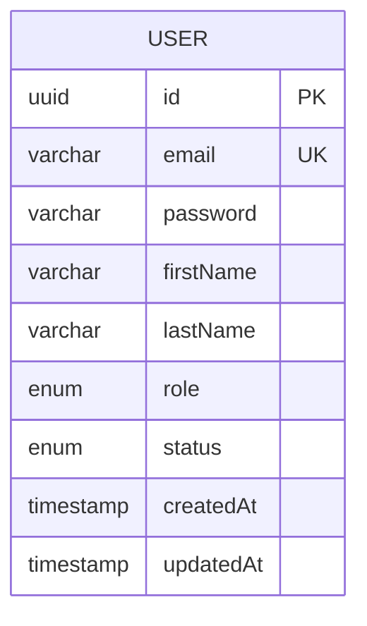

<div align="center">

# 👤 Users Service

_A NestJS users and authentication service for the marketplace platform, backed by PostgreSQL and TypeORM._

---

📃 [About](#-about)&nbsp;&nbsp;•&nbsp;&nbsp;
🏗️ [Role in the Architecture](#️-role-in-the-architecture)&nbsp;&nbsp;•&nbsp;&nbsp;
🧠 [Architecture Concepts](#-architecture-concepts)&nbsp;&nbsp;•&nbsp;&nbsp;
🛠️ [Technologies](#️-technologies)&nbsp;&nbsp;•&nbsp;&nbsp;
💾 [Database Diagram](#-database-diagram)&nbsp;&nbsp;•&nbsp;&nbsp;
🚀 [Getting Started](#-getting-started)&nbsp;&nbsp;•&nbsp;&nbsp;
📖 [API Documentation](#-api-documentation)&nbsp;&nbsp;•&nbsp;&nbsp;
🧪 [Testing](#-testing)

</div>

---

## 📃 About

The users service is the identity and profile management boundary of the marketplace. It owns the user registry, account lifecycle, JWT authentication, and user/profile lookup endpoints in a NestJS service backed by TypeORM and PostgreSQL.

The service is the source of truth for user registration, login, profile retrieval, seller discovery, and token validation. It exposes an HTTP surface that is consumed by the API Gateway and keeps the user domain model separate from the other business services.

## 🏗️ Role in the Architecture

The users service receives requests from the API Gateway through the gateway’s auth, users, and validation routes. It is primarily a synchronous HTTP provider, but its main role is to expose authentication and user identity data to the API Gateway and downstream business flows.

In this repository, the gateway forwards:

- `POST /auth/register` to the users service register endpoint.
- `POST /auth/login` to the service’s login endpoint.
- `GET /auth/validate-token` to confirm token validity against the protected request context.
- `GET /users/profile`, `GET /users/sellers`, and `GET /users/:id` to the users service profile and seller endpoints.

The service itself exposes:

- `POST /auth/register`
- `POST /auth/login`
- `GET /auth/validate-token`
- `GET /users/profile`
- `GET /users/sellers`
- `GET /users/:id`

The users service is the authoritative source for email uniqueness, role and status checks, password hashing, JWT creation, and user entity persistence.

## 🧠 Architecture Concepts

This service implements the following patterns explicitly in code:

- **Database per Service** — the users service owns its own TypeORM/PostgreSQL configuration and entity map for the `User` entity.
- **API Gateway Pattern** — the API Gateway proxies authentication and user profile traffic into this service rather than exposing direct database access.
- **JWT-based Authentication** — the authentication service verifies credentials and signs a token with the payload `{ sub, email, role }` through NestJS JWT.
- **Protected Resource Pattern** — the `JwtAuthGuard` and `@Public()` decorator separate public endpoints such as registration and login from authenticated endpoints.
- **Observability Middleware** — the service exposes an HTTP metrics registry with `prom-client`, and an interceptor/middleware records request metrics for the service.
- **Health Checks** — the service’s health controller checks the underlying database connection using `TypeOrmHealthIndicator`.

## 🛠️ Technologies

- ⚙️ **[NestJS](https://nestjs.com/)** — modular HTTP application framework for controllers, modules, guards, services, and Swagger setup.
- 🟦 **[TypeScript](https://www.typescriptlang.org/)** — primary implementation language for the service.
- 🌐 **[Express](https://expressjs.com/)** — HTTP server platform used by NestJS.
- 🔐 **[@nestjs/jwt](https://github.com/nestjs/jwt)** — JWT creation and validation for authentication.
- 🛡️ **[@nestjs/passport](https://github.com/nestjs/passport)** — authentication strategy plumbing around JWT.
- 📘 **[@nestjs/swagger](https://docs.nestjs.com/openapi/introduction)** — OpenAPI/Swagger document generation.
- 🩺 **[@nestjs/terminus](https://docs.nestjs.com/recipes/terminus)** — health checks and database health indicators.
- 🗄️ **[@nestjs/typeorm](https://docs.nestjs.com/techniques/database)** — TypeORM integration for the users service.
- 🧾 **[TypeORM](https://typeorm.io/)** — ORM for persisting the `User` entity and mapping database columns.
- 🔑 **[bcryptjs](https://www.npmjs.com/package/bcryptjs)** — password hashing and password comparison for registration and login flows.
- 🐘 **[PostgreSQL](https://www.postgresql.org/)** — relational database for storing user accounts, roles, statuses, and timestamps.
- 🧪 **[Jest](https://jestjs.io/)** — unit and integration test runner for the service.
- 🧾 **[class-transformer](https://github.com/typestack/class-transformer)** — DTO and response serialization support.
- ✅ **[class-validator](https://github.com/typestack/class-validator)** — request payload validation.
- 📊 **[prom-client](https://github.com/siimon/prom-client)** — metrics registry and counters/histograms.

## 💾 Database Diagram



The `User` entity is the only persistent model defined in this service. It stores the account identity, password hash, role, status, and audit timestamps.

## 🚀 Getting Started

### Prerequisites

- [Node.js](https://nodejs.org/) 22+ recommended
- [npm](https://www.npmjs.com/) or [pnpm](https://pnpm.io/)
- A PostgreSQL instance or the provided Compose stack for the service

### Installation

1. Clone the repository:

   ```bash
   git clone https://github.com/joschonarth/marketplace-ms.git
   ```

2. Enter the service directory:

   ```bash
   cd marketplace-ms/users-service
   ```

3. Install dependencies:

   ```bash
   npm install
   ```

### Environment Variables

The service reads environment values for both the server and database. Copy the example file before running locally:

```bash
cp .env.example .env
```

The values declared in the example file are:

```env
PORT=3000
NODE_ENV=development
DB_HOST=localhost
DB_PORT=5433
DB_USERNAME=postgres
DB_PASSWORD=postgres
DB_DATABASE=users_db
JWT_SECRET=your-super-secret-jwt-key
```

### Database

The service’s `TypeOrmModule.forRoot(databaseConfig)` connects to PostgreSQL at the configured host and port. The default port in the example is `5433`, using the `users_db` database.

### Run the service

```bash
npm run start:dev
```

The default service port is `3000` unless overridden by the environment file.

## 📖 API Documentation

The service exposes a Swagger UI document for the users and authentication surface. Once the service is running, the interactive documentation is available at:

```text
http://localhost:3000/api
```

The OpenAPI document is configured with a bearer authentication scheme via `addBearerAuth()` in the Nest bootstrap file, so tokens can be entered through the Swagger UI authorization panel.

## 🧪 Testing

The service includes automated unit and e2e tests written with Jest and Supertest. The command to run the service tests is:

```bash
npm test
```

The repository also includes a dedicated e2e Jest configuration under `test/jest-e2e.json` and has controller/service specs under the `src` and `test` folders.

---

## ⭐ Support this Project

If this service helps you build a secure identity layer for a distributed marketplace, consider giving the repository a star on GitHub.

---

<div align="center">

Made with ♥ by **[João Otávio Schonarth](https://github.com/joschonarth)**

[](https://github.com/joschonarth)
[](https://linkedin.com/in/joschonarth)
[](mailto:joschonarth@gmail.com)

</div>
